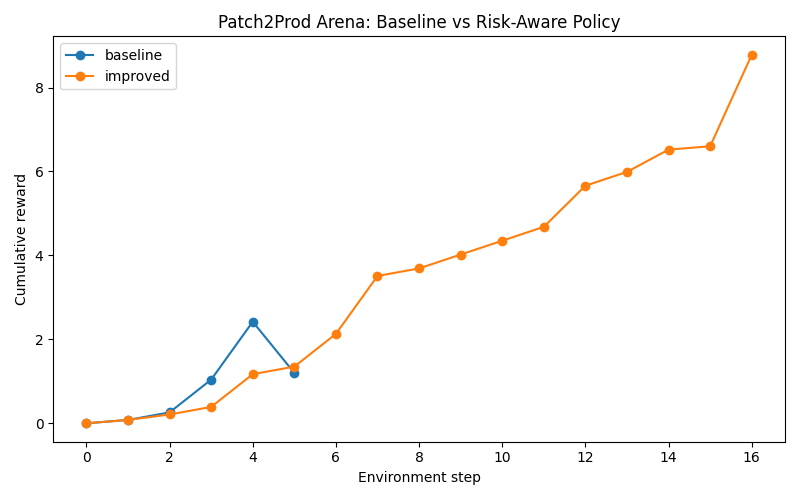

# Patch2Prod Arena

Patch2Prod Arena is an OpenEnv-style environment for training agents to answer the harder production question after CI goes green:

> Should this change actually ship?

The agent is not only rewarded for repairing the immediate failure, but also for diagnosing the causal change, reasoning about downstream blast radius, validating impacted services, and making a safe release decision.

**Deliverables**
- Hugging Face Space: https://huggingface.co/spaces/madhuria/patch2prod-arena
- Training script: [training/train_sft.py](training/train_sft.py) and [training/train_grpo.py](training/train_grpo.py)
- Evaluation script: [training/evaluate.py](training/evaluate.py)
- OpenEnv config: [openenv.yaml](openenv.yaml)
- Writeup / blog / video / slides: `ADD_LINK_HERE`
- Training notebook / Colab: `ADD_LINK_HERE`

**What The Agent Must Do**
1. Diagnose a failing CI pipeline.
2. Identify the causal change.
3. Apply a minimal patch.
4. Compute downstream blast radius.
5. Run targeted validations.
6. Make a release decision: `ship`, `block`, `canary`, `rollback`, or `request_owner_approval`.

**Environment API**
- `POST /reset`
- `POST /step`
- `GET /state`

Each action is one JSON object:

```json
{
  "action_type": "view_log",
  "params": {"job_name": "unit-tests"}
}
```

**Available Actions**
- `view_log(job_name)`
- `view_commit_history()`
- `view_diff(commit_id)`
- `cat(file_path)`
- `view_migration_guide(package)`
- `view_security_advisory(package)`
- `replace(file_path, search, replace)`
- `run_unit_tests(service)`
- `view_dependency_graph(service)`
- `mark_impacted_service(service, reason)`
- `run_contract_tests(service)`
- `view_ownership_map()`
- `submit_causal_change(commit, summary)`
- `submit_blast_radius(impacted_services)`
- `submit_release_decision(decision, reason, owner_to_notify)`
- `view_reward()`

**Reward Design**

The reward is compositional rather than a single pass/fail score. It currently includes independent checks for:

- CI repair
- Causal diagnosis
- Minimal repair quality
- Blast-radius reasoning
- Targeted downstream validation
- Release decision correctness
- Owner escalation
- Safety penalties for bad actions or unsupported behavior

The environment also applies a per-step cost and a timeout penalty when the episode reaches max steps without finishing.

**Key Plots**

Reward curve:



Loss curve:

`ADD_LOSS_CURVE_IMAGE_HERE`

**Repo Structure**
- [patch2prod/env.py](patch2prod/env.py): core environment and reward logic
- [patch2prod/server.py](patch2prod/server.py): FastAPI server for OpenEnv-style interaction
- [patch2prod/tasks.py](patch2prod/tasks.py): benchmark tasks
- [training/train_sft.py](training/train_sft.py): supervised fine-tuning starter
- [training/train_grpo.py](training/train_grpo.py): GRPO / RL training starter
- [training/evaluate.py](training/evaluate.py): scripted evaluation and trace generation
- [inference.py](inference.py): root-level inference script

**Run Locally**

Without Docker:

```bash
python -m venv .venv
source .venv/bin/activate
pip install -e .
patch2prod-demo
```

This produces:
- `artifacts/demo_results.json`
- `artifacts/plots/reward_curve.png`

Run the server locally:

```bash
uvicorn patch2prod.server:app --host 0.0.0.0 --port 8000
```

Demo frontend (static):

```bash
python -m http.server 5173 --directory demo-ui
```

Then open [http://localhost:5173](http://localhost:5173) and point API Base URL to `http://localhost:8000`.

Docker:

```bash
docker build -t patch2prod-arena .
docker run --rm -p 8000:8000 patch2prod-arena
```

Or:

```bash
docker compose up --build
```

**Training**

SFT:

```bash
python training/train_sft.py \
  --model Qwen/Qwen2.5-0.5B-Instruct \
  --train data/sft_traces.jsonl \
  --out outputs/sft_patch2prod
```

GRPO:

```bash
python training/train_grpo.py \
  --model outputs/sft_patch2prod \
  --train data/train_tasks.jsonl \
  --out outputs/grpo_patch2prod
```

Evaluation:

```bash
python training/evaluate.py \
  --policy baseline \
  --tasks data/eval_tasks.jsonl \
  --out artifacts/traces/baseline_trace.json

python training/evaluate.py \
  --policy improved \
  --tasks data/eval_tasks.jsonl \
  --out artifacts/traces/improved_trace.json
```

**Baseline Vs Improved**

Baseline policy behavior:
- Fixes the local failure.
- Runs unit tests.
- Ships too early.

Improved policy behavior:
- Diagnoses the causal change.
- Repairs the local issue.
- Checks downstream impact.
- Runs targeted validations.
- Makes a safer release decision.

This project is built to show that green CI is not enough when downstream contracts, release safety, and owner coordination still matter.
